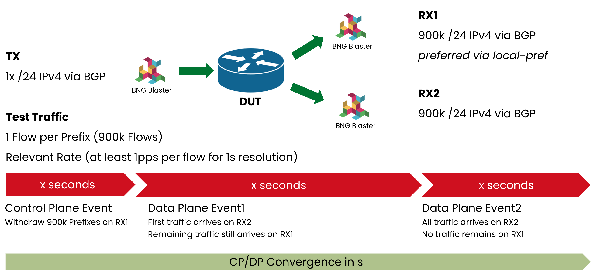

# BGP CP/DP Testing with Open Source Tools

This project demonstrates how to measure the convergence between the BGP Control-Plane (CP) and the Data-Plane (DP) using the open-source tool BNG Blaster. By utilizing BNG Blaster, we can analyze and monitor the time it takes for routing changes to propagate from the control-plane, where BGP updates occur, to the data-plane, where actual data packet forwarding happens.

## CP/DP Test Methodology



The BNG Blaster calculates the CP/DP convergence time based on following event timestamps:

+ **T1**: Start sending BGP withdraw from RX1
+ **T2**: Start sending BGP withdraw from RX1
+ **T3**: Start sending BGP withdraw from RX3
+ **S1**: All streams received on RX1
+ **S2**: All streams received on RX2
+ **S3**: No streams received on RX2

Convergence Times:

+ `C1 = S1 - T1`	Initial Convergence Time
+ `C2 = S2 - T2`	Switchover from RX1 to RX2
+ `C3 = S3 - T3`	Delete Time


## Prepare Test

+ [Install BNG Blaster](https://rtbrick.github.io/bngblaster/install.html) version 0.8.48 or newer togteher with the [BNG Blaster Controller](https://rtbrick.github.io/bngblaster/controller.html).
+ Replace the example interfaces `eth0-2` in the files `generate_routes.sh` and `blaster.json` with the actual interfaces used for `TX`, `RX1` and `RX2`.
+ Execute the script `generate_routes.sh` (this may takes a few minutes).
+ Copy the generated files to the server where the BNG Blaster controller is running:

```
scp *.bgp <user>@<blaster-controller>:/tmp/
scp streams.json <user>@<blaster-controller>:/tmp/
```

## Run Test

```
$ ./convergence.py --help
usage: convergence.py [-h] --host HOST [--port PORT] [--instance INSTANCE] [--rx1ip RX1IP] [--rx2ip RX2IP] [--timeout TIMEOUT]
                      [--log-level {warning,info,debug}]

BNG Blaster - BGP Convergence Report

options:
  -h, --help            show this help message and exit
  --host HOST           BNG Blaster Controller
  --port PORT           BNG Blaster Controller Port
  --instance INSTANCE   BNG Blaster Controller Instance
  --rx1ip RX1IP         RX1 local IP
  --rx2ip RX2IP         RX2 local IP
  --timeout TIMEOUT     Max convergence time expected
  --log-level {warning,info,debug}
                        logging Level

$ ./convergence.py --host <blaster-controller>
```
